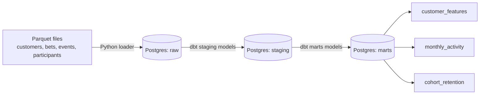

# Customer Churn ETL Pipeline

An end-to-end ETL pipeline for a synthetic sports betting platform, built to analyze customer activity, segmentation, and retention. Raw data flows through a layered transformation process (raw → staging → marts) using Python, PostgreSQL, dbt, and Dagster.

This project is a companion to a churn analysis EDA originally done in R — see [customer-churn-dataset](https://github.com/Hector658/customer-churn-dataset) for the dataset generation and exploratory analysis this pipeline is built on.

## Architecture



The entire pipeline is orchestrated with **Dagster**: raw extraction and dbt transformations are defined as a single graph of dependent assets, runnable end-to-end from Dagster's UI or CLI.

- **Extract**: a Python step reads synthetic parquet files and loads them into a `raw` schema in Postgres, in chunks to keep memory usage manageable on large tables.
- **Transform (staging)**: dbt models clean and standardize each raw table into a `staging` schema, with automated data quality tests (uniqueness, non-null keys, referential integrity).
- **Transform (marts)**: dbt models build business-ready tables in a `marts` schema — per-customer features, monthly activity trends, and cohort retention — ready for analysis, dashboards, or downstream ML.
- **Orchestration**: Dagster assets tie extraction and dbt together into one dependency graph, so the whole pipeline can be materialized with a single action, in the correct order, with dbt's tests running automatically as part of the same run.

## Tech stack

- **PostgreSQL 16** (via Docker) — the data warehouse
- **Python** (pandas, SQLAlchemy, psycopg2) — the extract/load step
- **dbt-postgres** — transformations, testing, and documentation
- **Dagster** (`dagster-dbt`) — pipeline orchestration
- **Docker Compose** — reproducible local environment

## Project structure


## Setup

### 1. Prerequisites
- Docker Desktop
- Python 3.12+

### 2. Clone and set up the environment
```bash
git clone https://github.com/Hector658/Customer-Churn-ETL.git
cd customer-churn-etl
python -m venv venv
.\venv\Scripts\Activate.ps1      # Windows
pip install -r requirements.txt
```

### 3. Generate the source data
The parquet files are not committed to this repo. Run the dataset generation notebook from [customer-churn-dataset](https://github.com/Hector658/customer-churn-dataset) and place the resulting files in `data/raw/`:
- `customers.parquet`
- `bets.parquet`
- `events.parquet`
- `participants.parquet`

### 4. Configure environment variables
Create a `.env` file in the project root:


Create a dbt profile at `~/.dbt/profiles.yml`:
```yaml
dbt_project:
  target: dev
  outputs:
    dev:
      type: postgres
      host: localhost
      port: 5432
      user: churn_user
      pass: churn_pass
      dbname: churn_db
      schema: staging
      threads: 1
```

### 5. Start Postgres
```bash
docker compose up -d
```

### 6. Run the pipeline

**Option A — orchestrated with Dagster (recommended):**
```bash
dagster dev -f orchestration/definitions.py
```
Open the URL shown in the terminal (defaults to `http://localhost:3000`), go to **Lineage**, and click **Materialize all** to run the full pipeline — raw extraction, staging, and marts — in the correct order, with dbt tests running automatically.

**Option B — manual, step by step:**
```bash
python raw_loader/load_raw.py
cd dbt_project
dbt run
dbt test
```

### 7. (Optional) Browse dbt documentation
```bash
cd dbt_project
dbt docs generate
dbt docs serve
```

## Data quality

The staging layer includes automated dbt tests covering:
- Primary key uniqueness and non-null constraints (`customers`, `events`, `participants`)
- Referential integrity between `bets` and `customers`/`events`

These tests run automatically as part of every Dagster materialization, and appear as asset checks directly in the Dagster UI.

During development, these checks (and manual inspection) caught a real data bug: a staging model was initially pointed at the wrong source table, silently loading customer data into what should have been a participants table. This is documented as a reminder of why automated schema/data tests matter in a pipeline, beyond just "the query ran."

## Roadmap

- [x] Load raw data into Postgres
- [x] Build staging and marts models in dbt, with automated tests
- [x] Orchestrate the full pipeline with Dagster
- [ ] Add an entity-relationship diagram and indexing notes
- [ ] Expose marts through SQL views for direct BI/reporting access